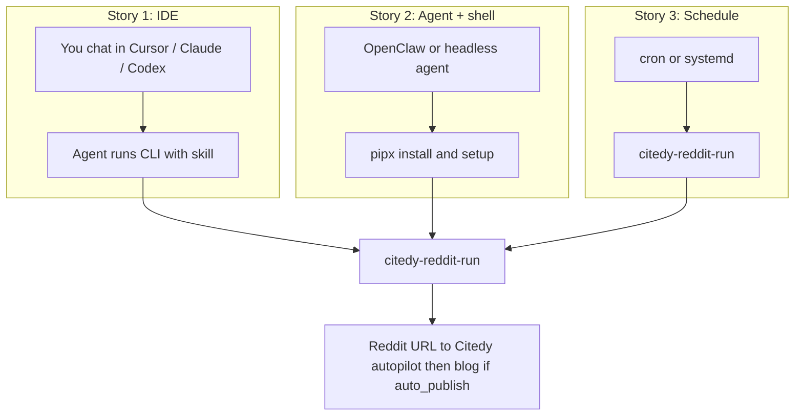
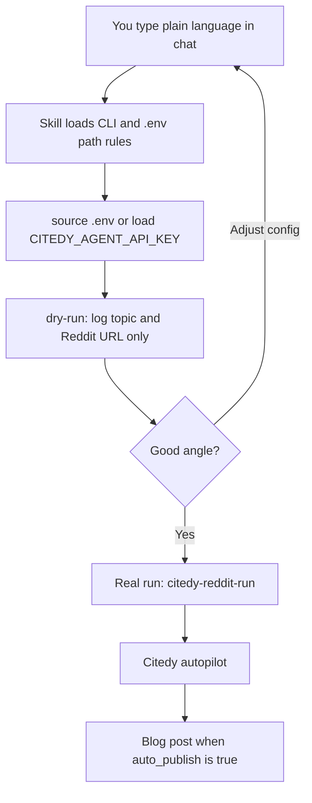
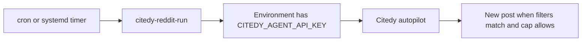
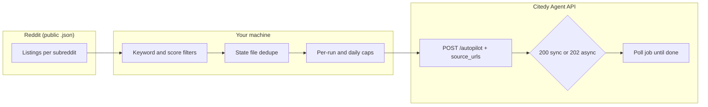

# citedy-reddit-writer

[](https://pypi.org/project/citedy-reddit-writer/)
[](https://www.python.org/downloads/)
[](LICENSE)

**Turn relevant Reddit threads into Citedy articles** — automatically, on a schedule, without spending **scout/reddit** credits on each poll.

This small CLI watches the subreddits you care about, keeps a local dedupe ledger, and calls Citedy’s **[Agent API `POST /api/agent/autopilot`](https://www.citedy.com)** with `source_urls` pointing at real Reddit posts. You choose filters, daily caps, and whether Citedy should **auto-publish** or stop at a draft.

|             | Links                                                                                    |
| ----------- | ---------------------------------------------------------------------------------------- |
| **Source**  | [github.com/citedy/citedy-reddit-writer](https://github.com/citedy/citedy-reddit-writer) |
| **Package** | [pypi.org/project/citedy-reddit-writer](https://pypi.org/project/citedy-reddit-writer)   |
| **Citedy**  | [citedy.com](https://www.citedy.com) — Agent API key (`citedy_agent_…`)                  |

---

## Install (fastest)

**Recommended** — isolated CLI (no virtualenv to remember):

```bash
pipx install citedy-reddit-writer
citedy-reddit-setup   # first time: writes config.yaml + .env
citedy-reddit-run --config config.yaml
```

**Or** with `pip` (use a venv in production):

```bash
pip install citedy-reddit-writer
```

Check the install:

```bash
citedy-reddit-run --help
citedy-reddit-setup --help
```

### Minimal run (API key only)

From **v0.1.1**, you can skip `config.yaml` if the bundled defaults are fine (sample subreddits `SEO`, `bigseo`, filters, caps — see `citedy_reddit_writer/default_config.yaml` in the repo). Set **`CITEDY_AGENT_API_KEY`** (and optionally **`CITEDY_BASE_URL`** if not using `https://www.citedy.com`), load `.env` if you use one, then:

```bash
set -a && source .env && set +a
citedy-reddit-run --dry-run
citedy-reddit-run
```

If **`config.yaml`** exists in the current directory, it wins. If there is no `config.yaml` but **`config.example.yaml`** is present, that file is used. Otherwise the packaged defaults apply and relative paths (e.g. state file) resolve from **the current working directory**.

Upgrade later:

```bash
pipx upgrade citedy-reddit-writer
# or: pip install -U citedy-reddit-writer
```

### Reddit transport fallback

Reddit may intermittently block one HTTP stack while allowing another for the exact same public listing URL. The default **`reddit.transport: auto`** mode tries **`httpx`** first and automatically retries via Python’s stdlib **`urllib`** when Reddit returns a block page or a transport-specific fetch failure.

You can pin the behavior if you need to debug or force one path:

```yaml
reddit:
  transport: "auto" # auto | httpx | urllib
```

Or override it at runtime:

```bash
export CITEDY_REDDIT_TRANSPORT=urllib
```

---

## First run in two minutes

1. **Install** (see above).
2. Run **`citedy-reddit-setup`** — it asks for your Citedy base URL, **Agent API key**, subreddits, keyword filters, limits, and `auto_publish`. It writes **`config.yaml`** and **`.env`** (keep the key in `.env`, not in git).
3. Load env and run once:

   ```bash
   set -a && source .env && set +a
   citedy-reddit-run --config config.yaml
   ```

**Dry-run** (no API calls, no state file updates — safe to try anytime):

```bash
citedy-reddit-run --config config.yaml --dry-run
```

---

## Get your Agent API key

This CLI talks to Citedy’s **Agent API** using a key that looks like `citedy_agent_…`. Put it in **`.env`** as **`CITEDY_AGENT_API_KEY`** (the setup wizard does this for you).

**Option A — Dashboard (fastest for most people)**

1. Sign in at [citedy.com](https://www.citedy.com).
2. Open **Settings → Team & API**:  
   [citedy.com/dashboard/settings?section=team](https://www.citedy.com/dashboard/settings?section=team)
3. Create or copy your **Agent API key** and paste it when **`citedy-reddit-setup`** asks — or add it manually to `.env`:

   ```bash
   CITEDY_AGENT_API_KEY=citedy_agent_your_key_here
   ```

**Option B — Register an agent via API (one-time, email approval)**

```bash
curl -sS -X POST "https://www.citedy.com/api/agent/register" \
  -H "Content-Type: application/json" \
  -d '{"email":"you@example.com","name":"My Agent"}'
```

Open the **approval link** in the email you receive. The JSON may return a field named **`api_key`** — put **that value** in `.env` as **`CITEDY_AGENT_API_KEY=…`**. This is the **same env name** this CLI, **`citedy-reddit-setup`**, and **Citedy MCP** expect for the Agent API (Bearer token).

**Sanity check**

```bash
curl -sS "https://www.citedy.com/api/agent/health" \
  -H "Authorization: Bearer $CITEDY_AGENT_API_KEY"
```

---

## Real-world stories (human flow)

These are **not** magic prompts into Reddit itself — the tool **fetches public subreddit listings locally**, picks a post that matches your filters, then sends **one Reddit URL** to Citedy autopilot. The “human” part is how you drive it from an IDE or another agent.

**Overview — three ways to drive the same CLI**



### Story 1 — You’re in **Cursor**, **Claude Code**, or **Codex**



1. **Install** (once): `pipx install citedy-reddit-writer` (or `pip install …`).
2. In a terminal (or ask the agent to run it): **`citedy-reddit-setup`** — point at **`r/SEO`** (or your niches), add keywords like `agency`, `growth`, `ranking`, set **`auto_publish: true`** if you want live posts on **your** Citedy blog.
3. You type in chat, in plain language:  
   _“Run `citedy-reddit-run --config config.yaml --dry-run` and tell me which Reddit thread you would send to Citedy.”_  
   The skill / agent should **`cd` into the project folder**, **`source .env`**, then run the command. You see **no article yet** — only log lines like _DRY_RUN: would call autopilot …_ with a **topic + URL**.
4. When it looks right:  
   _“Same thing but for real — one article, env loaded.”_  
   → `citedy-reddit-run --config config.yaml`
5. If autopilot succeeds and **`auto_publish`** is on, a post can appear on **your blog** on [citedy.com](https://www.citedy.com) within the time your plan allows (async jobs may take minutes).

**Why use the skill?** So the agent knows the flags, your `config.yaml` path, and never pastes your key into chat — only reads **`.env`**.

### Story 2 — **OpenClaw**, **Claude Code** on a headless box, or “any agent with a shell”


1. You (or the agent) run:  
   `pipx install citedy-reddit-writer`
2. You say:  
   _“After install, run `citedy-reddit-setup` and configure for [topic]. Then dry-run once.”_
3. Same pattern: **dry-run first** (safe), then **real run** when you approve.  
   You can paste the **skill text** from this repo (`.claude/skills/…` / `.cursor/skills/…`) into the product’s skill store so the agent doesn’t guess the CLI.

### Story 3 — **Scheduled**, hands-off



You don’t talk to the IDE for each post: **cron** or **systemd** runs `citedy-reddit-run` every few hours. The “conversation” happened once when you wrote `config.yaml`.

---

## Case study: from “what’s hot on r/SEO?” to a **live article**

**Setup:** Subreddit **`r/SEO`**, filters around **agency growth / SEO industry / ranking**, reasonable **`min_score`** and **`max_age_hours`**, **`articles_per_run: 1`**, **`auto_publish: true`**.

1. **Dry-run** — You (or your agent) run:  
   `citedy-reddit-run --config config.yaml --dry-run`  
   Logs show **which thread** would be used as `source_urls` and the **synthetic topic** string — **no Citedy write**, no state update.

2. **Real run** — Same command **without** `--dry-run`, with **`CITEDY_AGENT_API_KEY`** in the environment. The CLI calls **`POST /api/agent/autopilot`** with that Reddit URL; Citedy generates the article and, with **`auto_publish`**, can publish to your site.

3. **Outcome (real example)** — One such production-style run produced a long-form guide that went **live on the Citedy blog**, e.g.  
   **[SEO Agency Growth Guide: Build Your Agency Through SEO Only](https://www.citedy.com/blog/seo-agency-growth-guide-build-your-agency-through-seo-only)**  
   Your URLs will differ by **account**, **topic**, and **filters**; this link illustrates the end state: a **public post** you can share, not a file stuck on your laptop.

**Takeaway:** Install → key from **Team & API** (or register flow) → **setup wizard** → **dry-run** (human checks the angle) → **one real run** → optional **live blog post** on your Citedy-hosted content.

---

## How it works

High-level flow:



**Step by step**

1. **Fetch** recent posts from each configured subreddit using Reddit’s **public** listing endpoints (not the paid “scout” Reddit scout inside Citedy — so you don’t burn scout credits on every scheduler tick). In the default `auto` mode the CLI will retry with an alternate HTTP transport if Reddit blocks the first attempt.
2. **Filter** by include/exclude keywords, minimum score, and max post age.
3. **Dedupe** using a local JSON state file (post IDs and title hashes), optionally cross-checking **recent article titles** from your Citedy account so you don’t repeat topics.
4. **Respect caps**: `articles_per_run` and `max_articles_per_day` prevent bursts.
5. For each chosen post, build a **topic** from your template and call **autopilot** with **`source_urls: [post.url]`** (and your `auto_publish`, `language`, `size`, etc.).
6. If the API returns **202**, the CLI **polls** the job until it finishes or times out (configurable). On success, state is updated so the same post is not picked again.

You can run this **manually**, from **cron**, or via **systemd timer** (see `crontab.example` and `systemd/`).

---

## Why this exists

- **Automation**: Same story as “I want a steady pipeline from social signals to published content,” without babysitting the UI.
- **Cost-aware**: Polling Reddit uses **public** listings + your own rate limits; it does **not** use Citedy’s **scout/reddit** quota for those fetches.
- **Control**: You own `config.yaml` — subreddits, filters, caps, and whether articles go live with **`auto_publish`**.

---

## Configuration

| What            | How                                                                                                                                        |
| --------------- | ------------------------------------------------------------------------------------------------------------------------------------------ |
| **Interactive** | `citedy-reddit-setup` → `config.yaml` + `.env`                                                                                             |
| **Reference**   | `config.example.yaml` (all keys explained in comments)                                                                                     |
| **Env vars**    | `CITEDY_AGENT_API_KEY` (required), `CITEDY_REDDIT_CONFIG` (config path), optional `CITEDY_BASE_URL`, `CITEDY_ALERT_WEBHOOK_URL`, `DRY_RUN` |

Paths like `dedupe.state_path` are resolved **relative to the config file’s directory**.

---

## Scheduling

- **Cron**: see `crontab.example`.
- **systemd**: `systemd/citedy-reddit-writer.service` + `citedy-reddit-writer.timer`.

Ensure the service environment loads **`.env`** or injects `CITEDY_AGENT_API_KEY` securely.

---

## Agent skills (Claude Code, Cursor, Codex)

| Environment     | Skill / command                                                                                                                         |
| --------------- | --------------------------------------------------------------------------------------------------------------------------------------- |
| **Claude Code** | `.claude/skills/citedy-reddit-writer/SKILL.md` + slash command **`/citedy-reddit-writer`** (`.claude/commands/citedy-reddit-writer.md`) |
| **Cursor**      | In the **saas-blog** monorepo: `.cursor/skills/citedy-reddit-writer/SKILL.md`                                                           |
| **Codex**       | In the **saas-blog** monorepo: `.codex/skills/citedy-reddit-writer/SKILL.md`                                                            |

This repo includes **`.claude/`** and **`.cursor/skills/`** for a **standalone clone**. For Codex-only setups, copy `.codex/skills/...` from the monorepo if needed.

### saas-blog monorepo: one command from the Next.js repo root

If **`CITEDY_AGENT_API_KEY`** (and optional vars) live in the **monorepo** `.env` and `config.yaml` is under **`citedy-reddit-writer/`** (after `citedy-reddit-setup`), run:

```bash
npm run citedy-reddit-writer -- --dry-run   # safe: no API writes
npm run citedy-reddit-writer                # real run
```

This uses **`run-with-env.sh`**: loads **`../.env`** then **`citedy-reddit-writer/.env`** (package overrides parent). Uses **`citedy-reddit-writer/.venv/bin/citedy-reddit-run`** when present; otherwise **`citedy-reddit-run`** on `PATH`. Install once: `cd citedy-reddit-writer && python3 -m venv .venv && .venv/bin/pip install -e .`.

---

## Development install (from a git clone)

```bash
git clone https://github.com/citedy/citedy-reddit-writer.git
cd citedy-reddit-writer
python3 -m venv .venv
source .venv/bin/activate
pip install -e .
citedy-reddit-setup
```

---

## Requirements & etiquette

- **Python 3.10+**
- A valid **Citedy Agent API** key.
- Respect **[Reddit Data API terms](https://www.redditinc.com/policies/data-api-terms)**: set a honest **`user_agent`**, don’t hammer endpoints, stay within reasonable automation.

---

## Security

- Do **not** commit **`.env`** or a `config.yaml` that embeds `agent_api_key`. Prefer an empty key in YAML and load secrets from the environment.
- Treat `config.yaml` and state files as **sensitive** if they reveal your editorial strategy.

---

## For maintainers

Open-source **users** only need this repo and PyPI. **Releasing** (monorepo → [citedy/citedy-reddit-writer](https://github.com/citedy/citedy-reddit-writer), subtree, PyPI tags) is documented **inside the private Citedy monorepo** at `docs/citedy-reddit-writer/DEPLOYMENT.md` — it is intentionally **not** shipped here.

---

## License

MIT — see [`LICENSE`](LICENSE).
