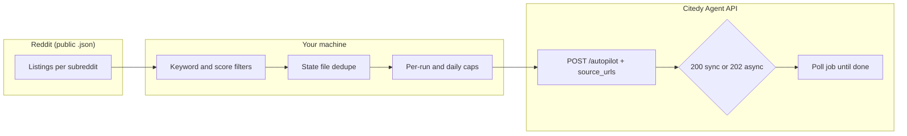

# citedy-reddit-writer

[](https://pypi.org/project/citedy-reddit-writer/)
[](https://www.python.org/downloads/)
[](LICENSE)

**Turn relevant Reddit threads into Citedy articles** — automatically, on a schedule, without spending **scout/reddit** credits on each poll.

This small CLI watches the subreddits you care about, keeps a local dedupe ledger, and calls Citedy’s **[Agent API `POST /api/agent/autopilot`](https://www.citedy.com)** with `source_urls` pointing at real Reddit posts. You choose filters, daily caps, and whether Citedy should **auto-publish** or stop at a draft.

|             | Links                                                                                    |
| ----------- | ---------------------------------------------------------------------------------------- |
| **Source**  | [github.com/citedy/citedy-reddit-writer](https://github.com/citedy/citedy-reddit-writer) |
| **Package** | [pypi.org/project/citedy-reddit-writer](https://pypi.org/project/citedy-reddit-writer)   |
| **Citedy**  | [citedy.com](https://www.citedy.com) — Agent API key (`citedy_agent_…`)                  |

---

## Install (fastest)

**Recommended** — isolated CLI (no virtualenv to remember):

```bash
pipx install citedy-reddit-writer
citedy-reddit-setup   # first time: writes config.yaml + .env
citedy-reddit-run --config config.yaml
```

**Or** with `pip` (use a venv in production):

```bash
pip install citedy-reddit-writer
```

Check the install:

```bash
citedy-reddit-run --help
citedy-reddit-setup --help
```

Upgrade later:

```bash
pipx upgrade citedy-reddit-writer
# or: pip install -U citedy-reddit-writer
```

---

## First run in two minutes

1. **Install** (see above).
2. Run **`citedy-reddit-setup`** — it asks for your Citedy base URL, **Agent API key**, subreddits, keyword filters, limits, and `auto_publish`. It writes **`config.yaml`** and **`.env`** (keep the key in `.env`, not in git).
3. Load env and run once:

   ```bash
   set -a && source .env && set +a
   citedy-reddit-run --config config.yaml
   ```

**Dry-run** (no API calls, no state file updates — safe to try anytime):

```bash
citedy-reddit-run --config config.yaml --dry-run
```

---

## How it works

High-level flow:



**Step by step**

1. **Fetch** recent posts from each configured subreddit using Reddit’s **public** listing endpoints (not the paid “scout” Reddit scout inside Citedy — so you don’t burn scout credits on every scheduler tick).
2. **Filter** by include/exclude keywords, minimum score, and max post age.
3. **Dedupe** using a local JSON state file (post IDs and title hashes), optionally cross-checking **recent article titles** from your Citedy account so you don’t repeat topics.
4. **Respect caps**: `articles_per_run` and `max_articles_per_day` prevent bursts.
5. For each chosen post, build a **topic** from your template and call **autopilot** with **`source_urls: [post.url]`** (and your `auto_publish`, `language`, `size`, etc.).
6. If the API returns **202**, the CLI **polls** the job until it finishes or times out (configurable). On success, state is updated so the same post is not picked again.

You can run this **manually**, from **cron**, or via **systemd timer** (see `crontab.example` and `systemd/`).

---

## Why this exists

- **Automation**: Same story as “I want a steady pipeline from social signals to published content,” without babysitting the UI.
- **Cost-aware**: Polling Reddit uses **public** listings + your own rate limits; it does **not** use Citedy’s **scout/reddit** quota for those fetches.
- **Control**: You own `config.yaml` — subreddits, filters, caps, and whether articles go live with **`auto_publish`**.

---

## Configuration

| What            | How                                                                                                                                        |
| --------------- | ------------------------------------------------------------------------------------------------------------------------------------------ |
| **Interactive** | `citedy-reddit-setup` → `config.yaml` + `.env`                                                                                             |
| **Reference**   | `config.example.yaml` (all keys explained in comments)                                                                                     |
| **Env vars**    | `CITEDY_AGENT_API_KEY` (required), `CITEDY_REDDIT_CONFIG` (config path), optional `CITEDY_BASE_URL`, `CITEDY_ALERT_WEBHOOK_URL`, `DRY_RUN` |

Paths like `dedupe.state_path` are resolved **relative to the config file’s directory**.

---

## Scheduling

- **Cron**: see `crontab.example`.
- **systemd**: `systemd/citedy-reddit-writer.service` + `citedy-reddit-writer.timer`.

Ensure the service environment loads **`.env`** or injects `CITEDY_AGENT_API_KEY` securely.

---

## Agent skills (Claude Code, Cursor, Codex)

| Environment     | Skill / command                                                                                                                         |
| --------------- | --------------------------------------------------------------------------------------------------------------------------------------- |
| **Claude Code** | `.claude/skills/citedy-reddit-writer/SKILL.md` + slash command **`/citedy-reddit-writer`** (`.claude/commands/citedy-reddit-writer.md`) |
| **Cursor**      | In the **saas-blog** monorepo: `.cursor/skills/citedy-reddit-writer/SKILL.md`                                                           |
| **Codex**       | In the **saas-blog** monorepo: `.codex/skills/citedy-reddit-writer/SKILL.md`                                                            |

This repo includes **`.claude/`** and **`.cursor/skills/`** for a **standalone clone**. For Codex-only setups, copy `.codex/skills/...` from the monorepo if needed.

---

## Development install (from a git clone)

```bash
git clone https://github.com/citedy/citedy-reddit-writer.git
cd citedy-reddit-writer
python3 -m venv .venv
source .venv/bin/activate
pip install -e .
citedy-reddit-setup
```

---

## Requirements & etiquette

- **Python 3.10+**
- A valid **Citedy Agent API** key.
- Respect **[Reddit Data API terms](https://www.redditinc.com/policies/data-api-terms)**: set a honest **`user_agent`**, don’t hammer endpoints, stay within reasonable automation.

---

## Security

- Do **not** commit **`.env`** or a `config.yaml` that embeds `agent_api_key`. Prefer an empty key in YAML and load secrets from the environment.
- Treat `config.yaml` and state files as **sensitive** if they reveal your editorial strategy.

---

## License

MIT — see [`LICENSE`](LICENSE).
